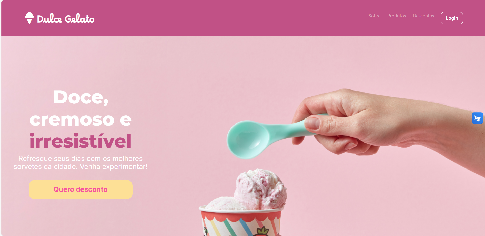
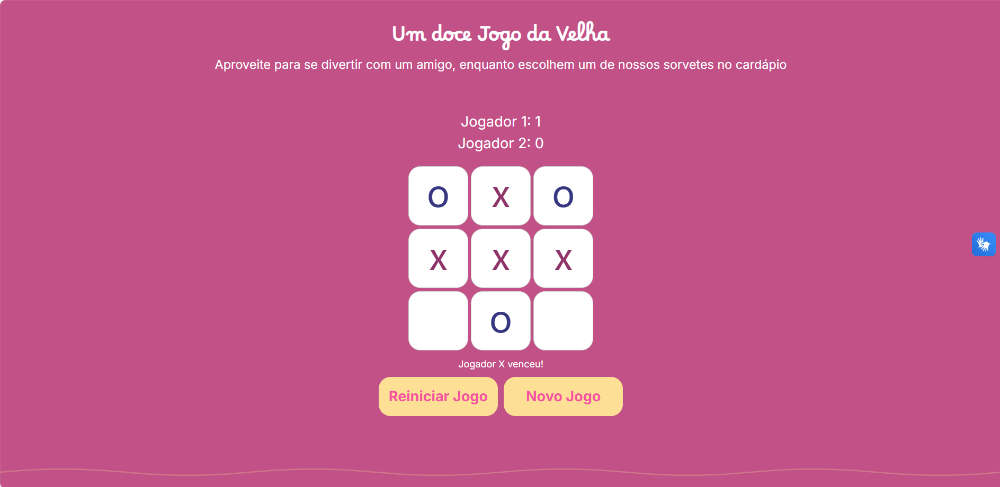

# Dulce Gelato 🍦🍨

## 📄 Resumo
Dulce Gelato é um projeto de **landing page para uma sorveteria**, desenvolvido com foco em design moderno e responsivo, para a disciplina de Desenvolvimento WEB III. O site conta com um **jogo da velha interativo**, desenvolvido em JavaScript, para entreter os visitantes e um **formulário de cadastro** que permite aos clientes se inscreverem para receber **cupons de desconto exclusivos**. Além disso, o site utiliza a API VLibras para garantir acessibilidade para usuários com deficiência auditiva.

  

  

## ⚙️ Tecnologias Utilizadas
- HTML5
- CSS3
- Bootstrap 5
- JavaScript
- API VLibras

## 👩‍💻 Desenvolvedoras
- Débora Carvalho
- Isabella Gonçalves

 (alunas do 3° semestre de Desenvolvimento de Software Multiplataforma da Fatec Zona Leste)

## 📅 Última Atualização
- **Data**: Fev.2025

